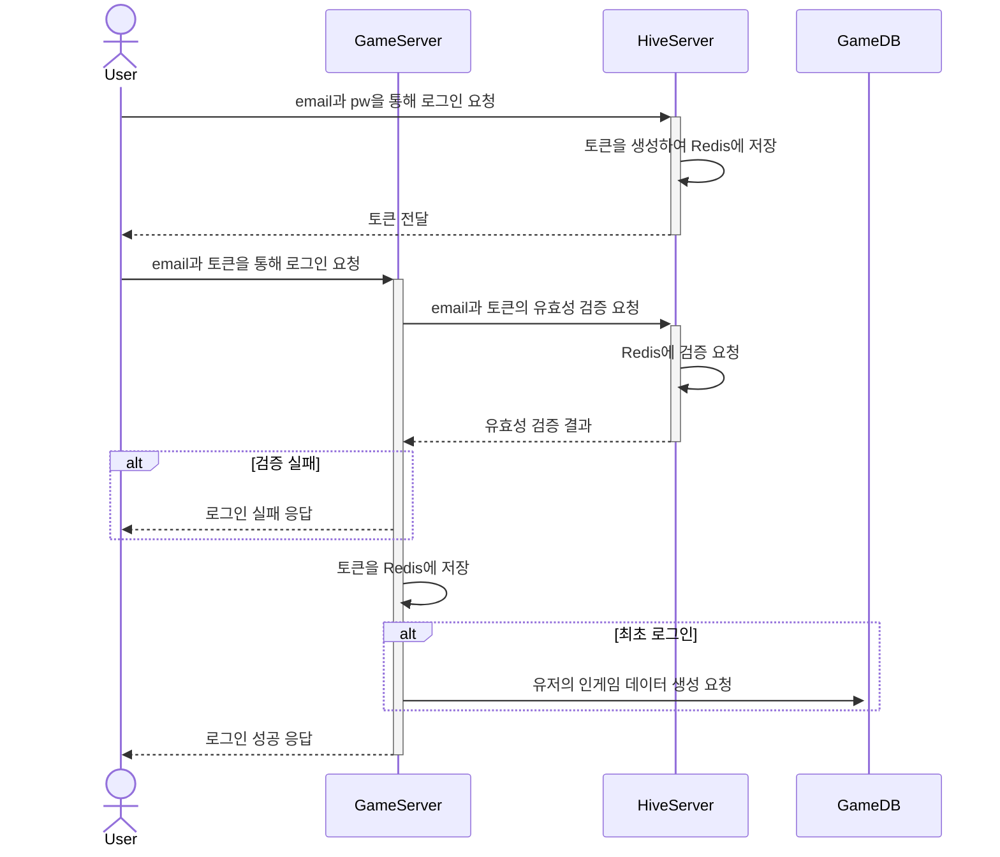
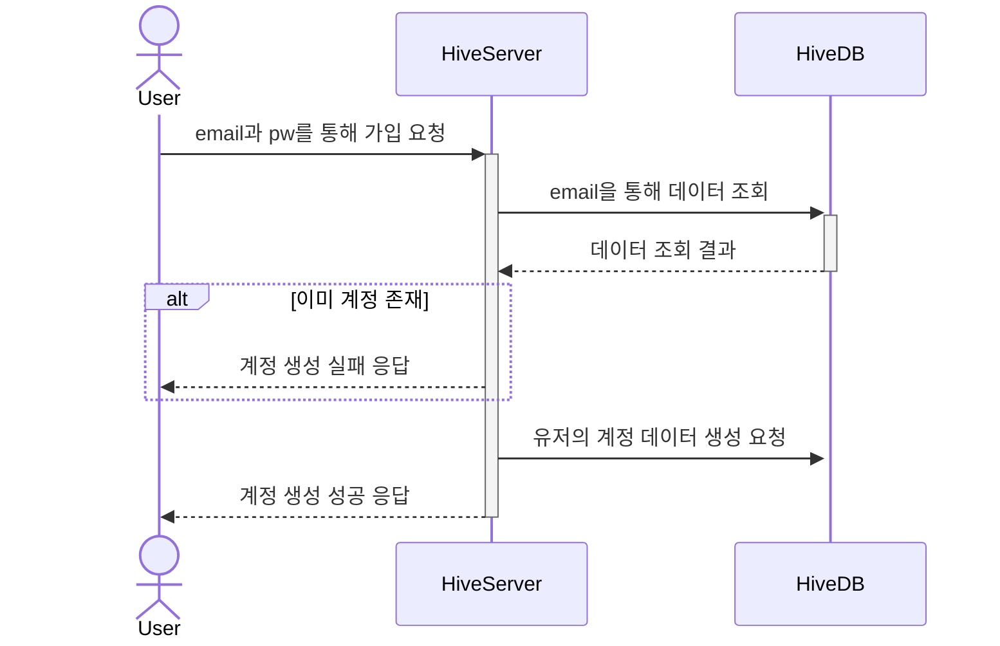
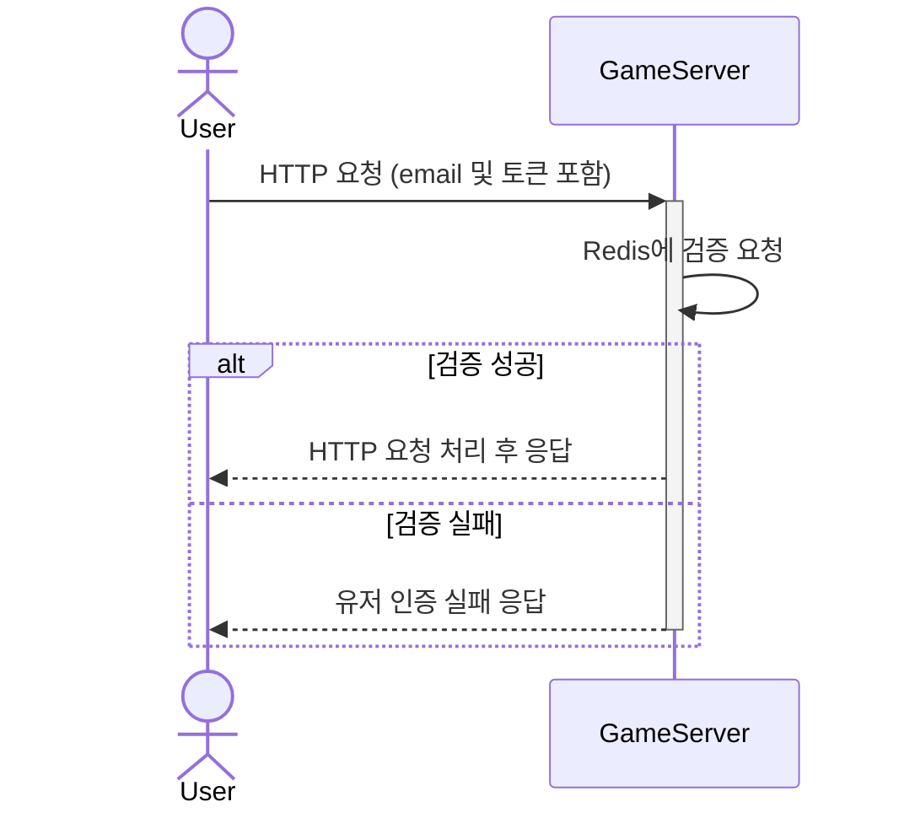
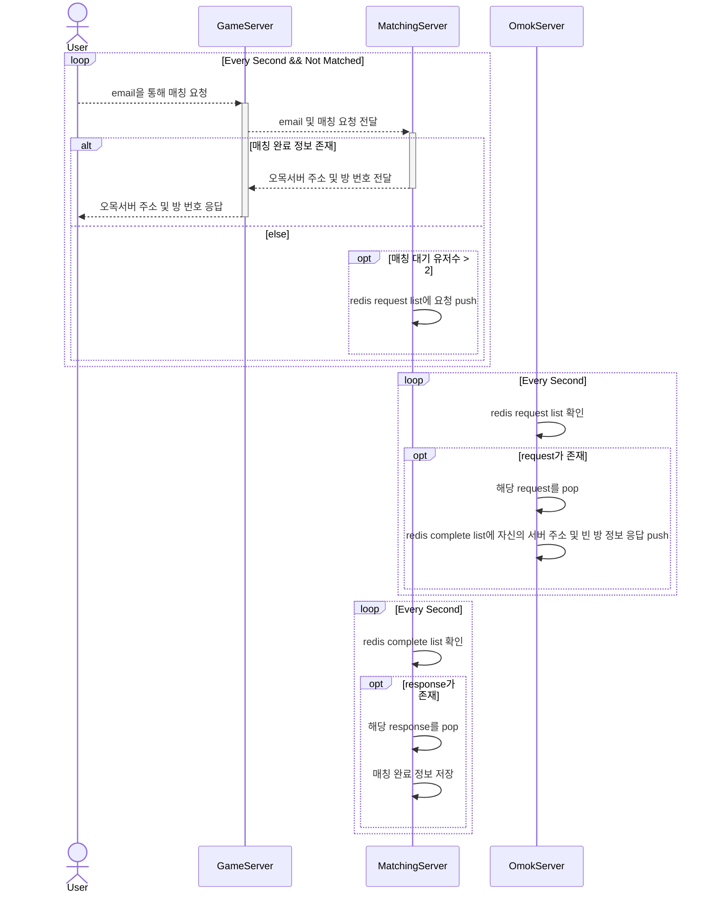
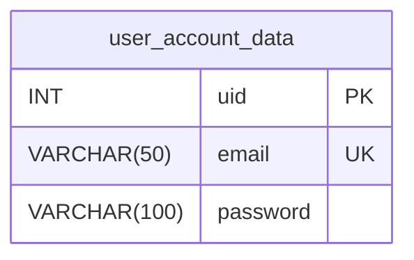
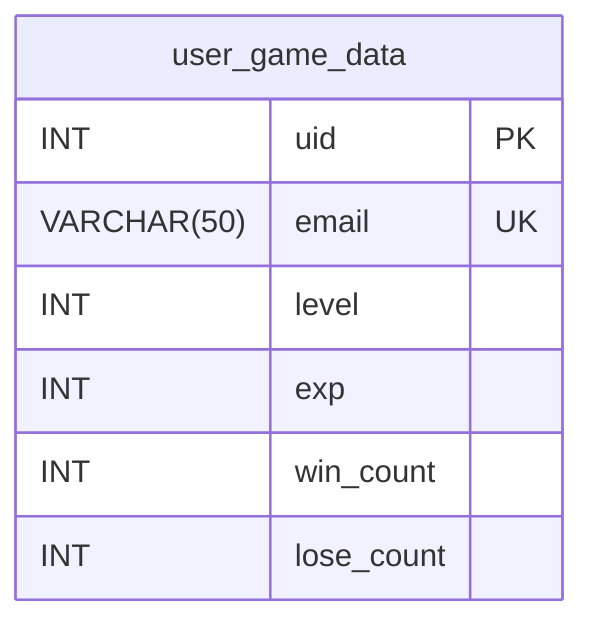

# 프로젝트 소개

- **온라인 오목 게임 서버**를 제작한 프로젝트입니다. 
- **3개의 API 서버**(Hiva Auth 서버, Game API 서버, Matching 서버) 및 **1개의 소켓 서버**(오목 서버)로 구성되어 있습니다.
- 오목 서버의 경우 **Scale Out**이 가능하도록 설계하였습니다. 

***

# 프로젝트 개요
- **개발 기간** : 2024.04. - 2024.06. (2개월)
- **참여 인원** : 1인
- **사용 언어** : C#
- **사용 도구** : ASP.NET Core 8, MySQL, Redis, AWS

***

# 전체 서버 구조

***

# 시퀀스 다이어그램
## 유저의 로그인

## 새로운 유저의 계정 생성

## HTTP 요청 시마다 유저 인증

## 유저 매칭

***

# DB 스키마
## 유저의 계정 데이터

## 유저의 인게임 데이터

***

# TODO-LIST

- **계정 기능**

|     **기능**     | **완료 여부** |
|:----------------:|:-------------:|
|     유저 등록    |       ✅       |
|      로그인      |       ✅       |
|     유저 인증    |       ✅       |
| 유저 데이터 로드 |       ✅       |
| 게임 데이터 로드 |       ✅       |
|     로그아웃     |       ✅       |

- **게임 기능**

|    **기능**    | **완료 여부** |
|:--------------:|:-------------:|
|      매칭     |       ✅       |
|     방 입장    |       ✅       |
|      채팅     |       ✅       |
|    게임 준비   |       ✅       |
|     돌 두기    |       ✅       |
|     타임아웃    |       ✅       |
| heart-beat  |       ✅       |
|    게임 종료   |       ✅       |
|    방 나가기   |       ✅       |
| 승패 기록 저장 |       ✅       |

- **부가 기능**

|  **기능** | **완료 여부** |
|:---------:|:-------------:|
| 출석 체크 |       ⬜       |
|   우편함  |       ⬜       |
|    친구   |       ⬜       |

***

# ASP.NET Core 학습 정리 문서
- [ASP.NET Core Docs](https://github.com/grace7040/AspNetCore-MVC-Docs)
