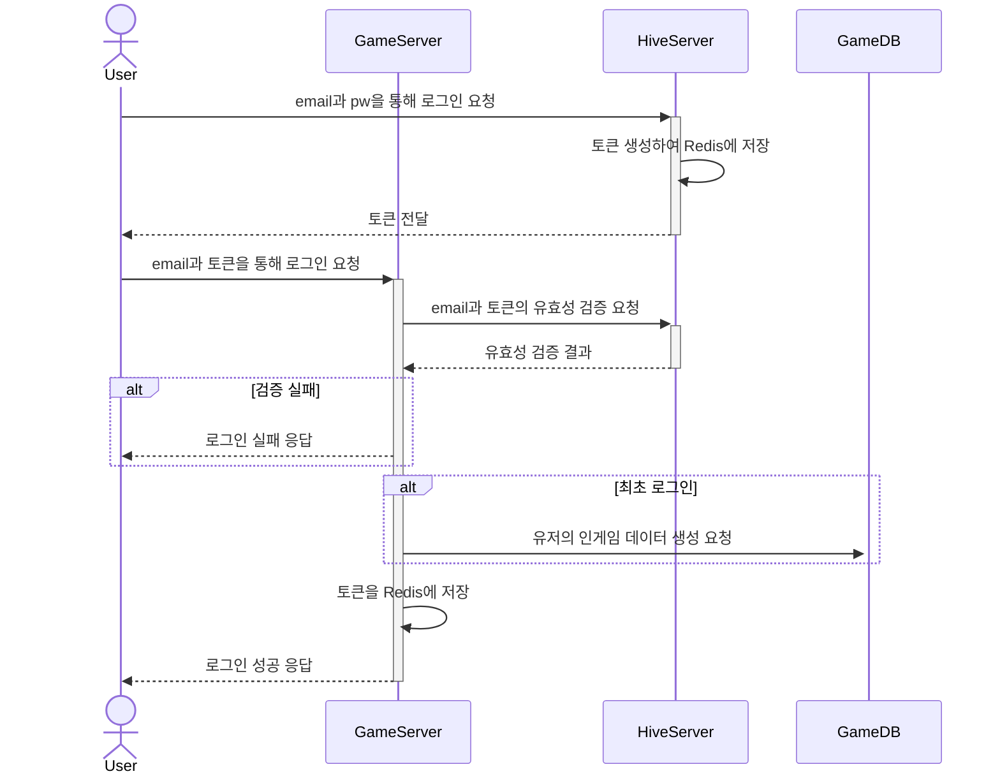
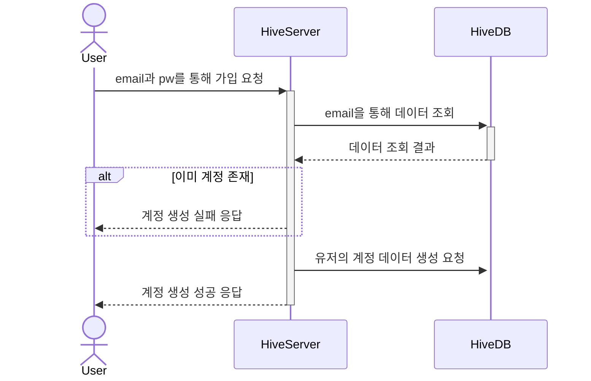

# 유저의 로그인

```mermaid
sequenceDiagram
    actor User
    participant GameServer
    participant HiveServer
    participant GameDB

    User->>+HiveServer: email과 pw을 통해 로그인 요청
    HiveServer->>HiveServer: 토큰 생성하여 Redis에 저장
    HiveServer-->>-User: 토큰 전달
    User->>+GameServer: email과 토큰을 통해 로그인 요청
    GameServer->>+HiveServer: email과 토큰의 유효성 검증 요청
    HiveServer-->>-GameServer: 유효성 검증 결과
    alt 검증 실패
        GameServer-->>User: 로그인 실패 응답
    end
    alt 최초 로그인
        GameServer->>+GameDB: 유저의 인게임 데이터 생성 요청
    end
    GameServer->>GameServer: 토큰을 Redis에 저장
    GameServer-->>-User: 로그인 성공 응답
```
---
# 새로운 유저의 계정 생성

```mermaid
sequenceDiagram
    actor User
    participant HiveServer
    participant HiveDB

    User->>+HiveServer: email과 pw를 통해 가입 요청
    HiveServer->>+HiveDB: email을 통해 데이터 조회
    HiveDB-->>-HiveServer: 데이터 조회 결과
    alt 이미 계정 존재
        HiveServer-->>User: 계정 생성 실패 응답
    end
    HiveServer->>+HiveDB: 유저의 계정 데이터 생성 요청
    HiveServer-->>-User: 계정 생성 성공 응답
```